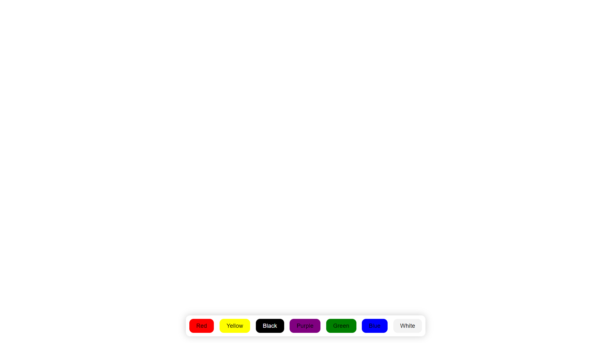

# BG-Color-Changer

Your task is to design and implement a Bg-Color-Changer application that meets the following requirements:

- The UI should resemble the example shown below..

- When user clicks on a red button, the background color should change to red.
